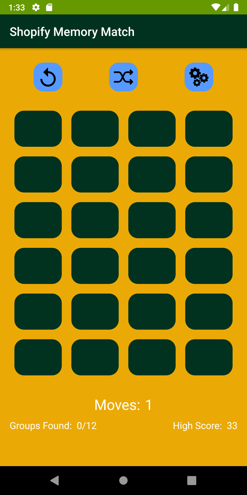
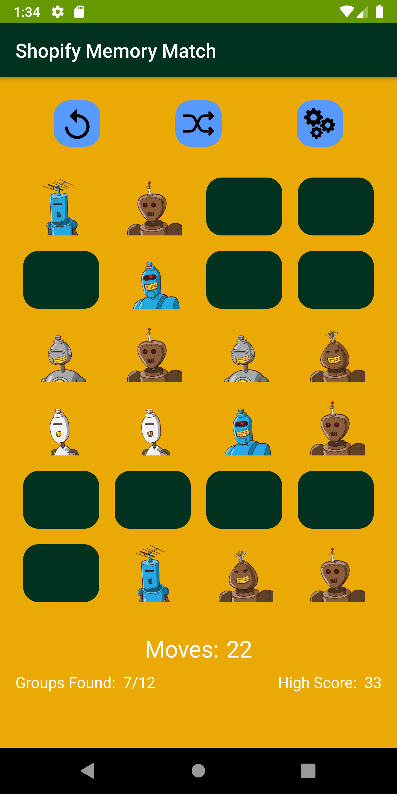
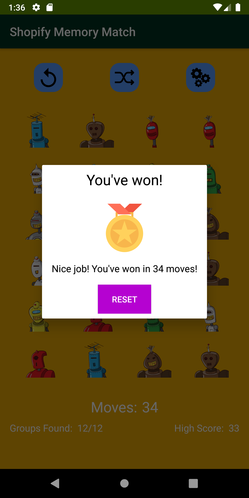

# Shopify Memory Match
Memory Match game for Shopify Internship Application

Libraries used:
* RxJava
* Retrofit
* Dagger
* Moshi
* Glide
* Android Jetpack (LiveData and ViewModel)

Features
* Reset game
* Shuffle cards
* Change number of same products to match
* Keep track of high score (least number of moves)

Sound effects used (from https://themushroomkingdom.net/media/smw/wav):
* Mario 1-Up sound (used when user matches the same products)
* Mario course clear sound (used when the user wins the game)

Medal image used when user wins (from https://www.svgrepo.com/svg/241828/medal) 

## Screenshots
### No Matches

### Some Matches

### All Matches

